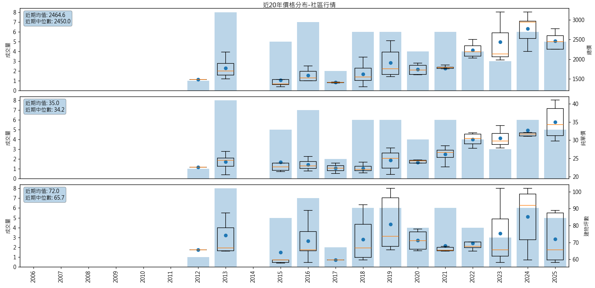

== 功能需求

=== 已知需求

. 標的物分析：
.. 地段/屋齡/坪數
.. 面寬/緃深/臨路
.. 採光/格局
.. 車位
.. 條件標準化
- 客人想要找三房車，所以拿演說家三房車與中悅桂冠三房車比，這樣合理嗎?
- 如果改成，慈文段_三房車 vs 慈文段_三房車，是否合理多了?
- 透天厝呢?

. 市場成交分析(實登)
.. 近一年成鈫
.. 相似物件篩選
.. 單價分佈

. 競品在售分析：你現在在跟誰競爭
. 價格定位模型
. 市場流動性分析
. 銷售策略建議
